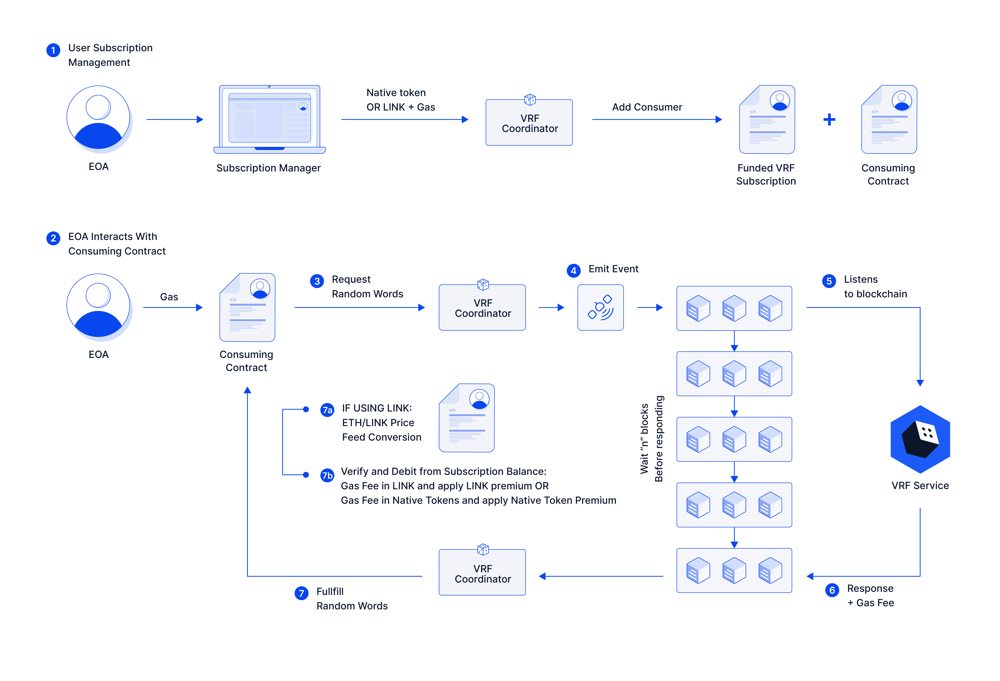
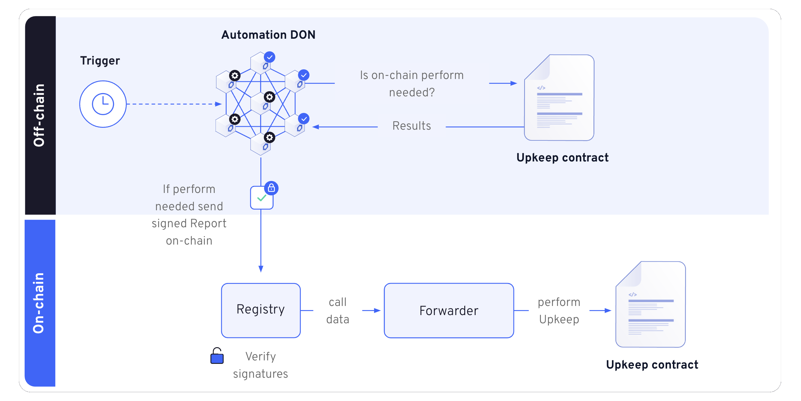

# Proveably Random Raffle Contracts

## About

This code is to create a proveably random smart contract lottery.

Lottery Contract (VRF Consumer) is deployed on Sepolia testnet: 0x6Cf72494550605Da051D612e10FEbdF488981Ba3

VRF Subscription Address: 0xbab69b1303fd3121285d7b9e1b8205680ec832a7

Upkeep Address:
0x6Cf72494550605Da051D612e10FEbdF488981Ba3

## Functionality

1. Users can enter the raffle by paying for a ticket. The ticket fees are for the prize the winner.
2. The lottery should automatically and programmatically draw a winner after a certain period.
3. Chainlink VRF should generate a provably random number.
4. Chainlink Automation should trigger the lottery draw regularly.

## Chainlink VRF

Chainlink VRF (Verifiable Random Function)

For more information about Chainlink VRF, go [here](https://vrf.chain.link/sepolia). VRF is a provably fair and verifiable random number generator (RNG) that enables smart contracts to access random values without compromising security or usability. For each request, Chainlink VRF generates one or more random values and cryptographic proof of how those values were determined. The proof is published and verified onchain before any consuming applications can use it.

2 methods to request randomness:

1. Subscription\* = what this project leverages
2. Direct Funding

Diagram Flow

## Chainlink Automation

Automate your smart contracts using a secure and hyper-reliable decentralized network that uses the same external network of node operators that secures billions in value.

For more information about Chainlink VRF, go [here](https://docs.chain.link/chainlink-automation).

Upkeeps are basically custom triggers that can be one of three types:

1. Time-based trigger - does NOT need to be compatible with `AutomationCompatibleInterface`
2. Custom logc trigger - this trigger contracts need to be compatible with `AutomationCompatibleInterface`
3. Log trigger - this trigger contracts need to be compatible with `AutomationCompatibleInterface`

For Custom/Log Trigger Contracts, you have to deploy to a [supported Testnet](https://docs.chain.link/chainlink-automation/overview/supported-networks). After deployment is complete, copy the address of the deployed contract. This address is required to register your upkeep in the [Automation UI](https://automation.chain.link/).

For Time-based, you can simply skip the deployment step and just register a new Upkeep

Diagram Flow

### Useful Scripts

#### Importing account

- cast wallet import myaccount --interactive

#### Funding Subscription

- forge script script/Interactions.s.sol:FundSubscription --rpc-url $SEPOLIA_URL --account myaccount --broadcast

### Coverage

- forge coverage

- forge coverage --report debug > coverage.txt

## Deploy

### Sepolia Testnet

1. Option1: Use forge script
   forge script DeployRaffle --rpc-url $(SEPOLIA_RPC_URL) --private-key $(PRIVATE_KEY) --broadcast --verify --etherscan-api-key $(ETHERSCAN_API_KEY) -vvvv

2. Option1: Use Makefile
